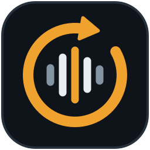
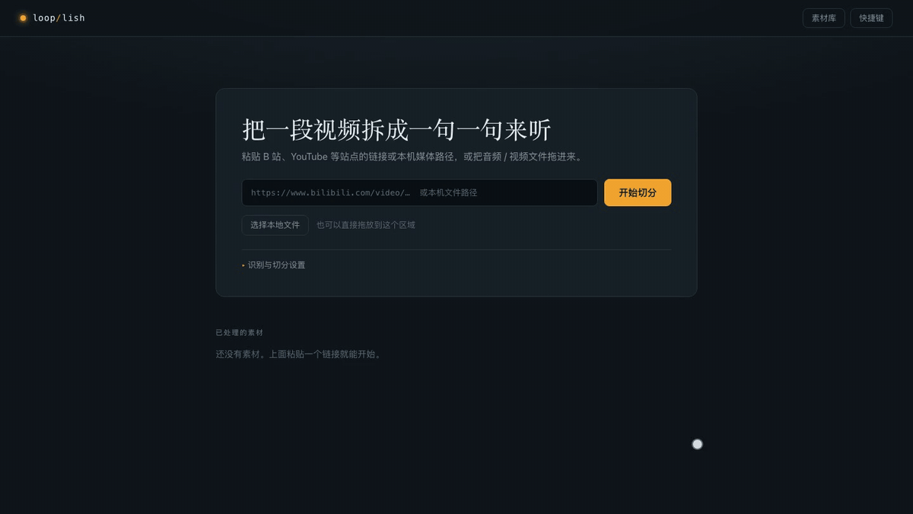

<div align="center">



# Looplish

**把一段视频 / 音频切成一句一句，逐句循环精听。**

简体中文 · [English](README.en.md)

[](LICENSE)
[](.python-version)
[](.nvmrc)
[](apps/api)
[](apps/web)

</div>

---

## 简介

Looplish 是一个在本机运行的听力练习工具。贴一个视频链接（或上传一个文件），它会下载媒体、获取字幕或用 Whisper 识别语音，再按停顿和标点把整段内容切成一句一句。之后你可以在「练习台」里逐句播放、循环、减速、遮住原文盲听，像使用语言实验室的复读机一样精听。

所有处理都在你自己的电脑上完成：素材、字幕和识别模型都保存在本地；除非你主动选择云端识别，音频不会离开本机。

## 为什么做 Looplish

**先听懂，再看懂。**

人学母语，是先听了好几年才开始认字。学外语却总是先看文字，耳朵反倒成了短板。

Looplish 把顺序换回来：遮住原文，一句一句反复听，听清了再看。

## 界面预览

<p align="center">
  
  <br />
  <sub>上传音频后自动切句；练习台里遮住原文逐句盲听，可以循环、减速，听完再显示原文</sub>
</p>

## 功能特性

- **多种来源**：粘贴 yt-dlp 支持的视频链接（YouTube、Bilibili 等），可以直接粘贴带标题的分享文案，会自动提取其中的链接；也可以上传或拖放本地音视频文件，或者在本机运行时直接填写文件路径。
- **字幕优先，识别兜底**：默认先用视频自带的人工字幕，没有时再做语音识别；也可以设为「只用自带字幕」或「总是重新识别」。
- **本地或云端识别**：本地使用 [faster-whisper](https://github.com/SYSTRAN/faster-whisper)，在 Apple 芯片上自动改用 [MLX](https://github.com/ml-explore/mlx) 调用 GPU 加速；也支持 OpenAI、Groq 等兼容 OpenAI 接口的云端服务。
- **智能切句**：结合词级时间戳、停顿和标点切句，并在句首句尾留出缓冲，避免吞音。最短 / 最长句长、停顿阈值、首尾留白都可以调整，处理完成后还能重新切句，无需再次识别。
- **练习台**：
  - 每句循环 1 / 2 / 3 / 5 遍或一直重复，语速 0.60× – 1.25×
  - 跟读间隔：固定 0 – 5 秒，或「与句子等长」
  - 遮住原文盲听，按需显示，也可以设为始终隐藏
  - 自动进入下一句、句子清单搜索、练习进度
  - 完整的键盘快捷键
- **导出**：字幕可导出为 SRT / VTT / TXT，或打包为 ZIP（可包含每句的 MP3 切片）。
- **处理进度可见**：下载、音频准备、识别、切句各阶段实时显示进度；任务在后台排队执行，服务重启时，上次没处理完的任务会被标记为中断，不会一直卡在「处理中」。

## 工作原理

```text
链接 / 文件 ──► 下载（yt-dlp） ──► 准备音频（ffmpeg） ──► 自带字幕 或 语音识别 ──► 智能切句 ──► 练习台 / 导出
```

| 阶段 | 说明 |
| --- | --- |
| 下载 | 仅链接任务需要，同时尝试下载自带字幕 |
| 准备音频 | 用 ffmpeg 读取时长，转成浏览器播放用的 `m4a` |
| 获取文本 | 按「字幕来源」设置选择现成字幕，或交给 ASR 后端识别，得到词级时间轴 |
| 切句 | 根据停顿、标点和时长上下限把词串切成句子 |

## 快速开始

### 用 Docker 一键启动（推荐）

只需要装好 [Docker](https://docs.docker.com/get-docker/)：

```bash
git clone https://github.com/ramblincole/looplish.git
cd looplish
```

```bash
docker compose up -d
```

首次运行会构建镜像，需要几分钟。完成后打开 <http://127.0.0.1:8756> 即可使用。

- 素材、字幕和下载的 Whisper 模型都保存在 Docker 卷 `looplish-data` 中，重建容器不会丢失。
- 需要修改识别模型、语言或使用云端识别时，执行 `cp .env.example .env` 后编辑 `.env`，再运行 `docker compose up -d` 生效。
- 容器内只能用 CPU 识别。Apple 芯片的 Mac 想用 MLX 调用 GPU 加速的话，请按下面的步骤从源码运行。
- 容器里不支持填写本机文件路径，本地文件请用上传或拖放。

### 从源码运行

#### 环境要求

| 依赖 | 版本 | 说明 |
| --- | --- | --- |
| [Python](https://www.python.org/) | 3.13 | 后端 |
| [uv](https://docs.astral.sh/uv/) | 最新版 | Python 依赖与虚拟环境管理 |
| [Node.js](https://nodejs.org/) | 24 | 前端 |
| [pnpm](https://pnpm.io/) | 10 | 前端包管理，可通过 `corepack enable` 启用 |
| [FFmpeg](https://ffmpeg.org/) | 任意较新版本 | 需要 `ffmpeg` 与 `ffprobe` 在 `PATH` 中，或在配置中指定路径 |

#### 1. 克隆并安装依赖

```bash
git clone https://github.com/ramblincole/looplish.git
cd looplish
```

```bash
uv sync --project apps/api --extra local-asr
```

```bash
pnpm install
```

> 只打算使用云端识别时，可以去掉 `--extra local-asr`，不安装本地 Whisper 相关依赖。

#### 2. 准备配置

```bash
cp .env.example .env
```

默认配置使用本地识别（`small.en` 模型，英语）。首次识别时会自动下载模型。完整配置见下文[配置](#配置)。

#### 3. 启动后端

在仓库根目录运行（后端会读取当前目录下的 `.env`）：

```bash
uv run --project apps/api --extra local-asr uvicorn looplish_api.main:app --host 127.0.0.1 --port 8756
```

#### 4. 启动前端

另开一个终端：

```bash
pnpm --dir apps/web dev
```

浏览器打开 <http://127.0.0.1:5173>，粘贴视频链接或选择本地文件，点「开始切分」即可。开发服务器会把 `/api` 与 `/health` 代理到 `127.0.0.1:8756`。

#### 单端口运行（可选）

不想同时开两个进程时，可以先构建前端，再让后端直接托管页面：

```bash
pnpm --dir apps/web build
```

```bash
LOOPLISH_WEB_DIST_DIR=apps/web/dist uv run --project apps/api --extra local-asr uvicorn looplish_api.main:app --host 127.0.0.1 --port 8756
```

然后打开 <http://127.0.0.1:8756>。

## 语音识别后端

用 `LOOPLISH_ASR_BACKEND` 选择后端：

| 值 | 说明 | 需要 |
| --- | --- | --- |
| `local`（默认） | 本地 Whisper。`LOOPLISH_ASR_ENGINE=auto` 时，在 Apple 芯片上且已安装 `mlx-whisper` 就用 GPU（MLX），否则使用 faster-whisper | `--extra local-asr` |
| `openai` | OpenAI 语音转写接口，默认模型 `whisper-1` | `LOOPLISH_ASR_API_KEY` |
| `groq` | Groq 语音转写接口，默认模型 `whisper-large-v3-turbo` | `LOOPLISH_ASR_API_KEY` |
| `fake` | 生成假数据，仅用于开发与测试 | — |

云端后端也可以通过 `LOOPLISH_ASR_BASE_URL` 指向其他兼容 OpenAI 接口的服务，用 `LOOPLISH_ASR_API_MODEL` 指定模型。超过接口大小限制的音频会自动分段上传。

## 配置

所有配置都是以 `LOOPLISH_` 为前缀的环境变量，也可以写在 `.env` 中，模板见 [`.env.example`](.env.example)。留空的项表示使用默认值。

<details>
<summary>常用配置项</summary>

| 变量 | 默认值 | 说明 |
| --- | --- | --- |
| `LOOPLISH_HOST` / `LOOPLISH_PORT` | `127.0.0.1` / `8756` | 服务监听地址（用于判断是否只在本机提供服务） |
| `LOOPLISH_WEB_ORIGIN` | `http://127.0.0.1:5173` | 允许跨域访问的前端地址 |
| `LOOPLISH_WEB_DIST_DIR` | 空 | 前端构建目录；设置后由后端托管页面 |
| `LOOPLISH_DATA_DIR` | 系统用户数据目录 | 素材与处理结果的存放位置 |
| `LOOPLISH_MODELS_DIR` | 系统用户缓存目录 | 本地识别模型的存放位置 |
| `LOOPLISH_LOG_DIR` | 系统用户日志目录 | 日志位置 |
| `LOOPLISH_FFMPEG_PATH` / `LOOPLISH_FFPROBE_PATH` | 从 `PATH` 查找 | FFmpeg 可执行文件路径 |
| `LOOPLISH_MAX_WORKERS` | `1` | 同时处理的任务数（1 – 4） |
| `LOOPLISH_MAX_UPLOAD_BYTES` / `LOOPLISH_MAX_DOWNLOAD_BYTES` | 2 GiB | 上传 / 下载大小上限 |
| `LOOPLISH_MAX_MEDIA_SECONDS` | `14400` | 媒体时长上限（秒） |
| `LOOPLISH_ASR_BACKEND` | `local` | 识别后端，见上文 |
| `LOOPLISH_ASR_MODEL` | `small.en` | 本地 Whisper 模型 |
| `LOOPLISH_LANGUAGE` | `en` | 识别语言，`auto` 表示自动检测 |
| `LOOPLISH_ASR_ENGINE` | `auto` | 本地识别引擎：`auto` / `faster-whisper` / `mlx` |
| `LOOPLISH_ASR_DEVICE` / `LOOPLISH_ASR_COMPUTE_TYPE` | `auto` / `int8` | faster-whisper 的设备与精度 |
| `LOOPLISH_ASR_CPU_THREADS` | 空 | faster-whisper 的 CPU 线程数（0 – 64）；留空或 `0` 时按核心数自动选择（核心数的 2/3，限定在 4 – 12） |
| `LOOPLISH_SUBTITLE_SOURCE` | `auto` | 字幕来源：`auto` / `existing` / `asr` |
| `LOOPLISH_SUBTITLE_LANGUAGES` | `en,en-US,en-GB` | 优先使用的字幕语言 |
| `LOOPLISH_SEG_MIN_SECONDS` / `LOOPLISH_SEG_MAX_SECONDS` | `1.0` / `30.0` | 单句最短 / 最长时长；最长只作兜底，超长句只在停顿或逗号处拆开 |
| `LOOPLISH_SEG_HARD_PAUSE_SECONDS` | `0.75` | 转写缺少标点时，超过这个停顿就断句；有标点时以句末标点为准 |
| `LOOPLISH_SEG_LEAD_PAD_SECONDS` / `LOOPLISH_SEG_TAIL_PAD_SECONDS` | `0.30` / `0.40` | 句首 / 句尾留白，最多用满句间空隙，不会盖到相邻句 |
| `LOOPLISH_ALLOW_LOCAL_PATHS` | 空 | 是否允许用服务器本机路径创建任务；留空时仅在监听回环地址时允许 |

</details>

> **安全提示**：服务默认只监听 `127.0.0.1`。如果要对外提供服务（例如监听 `0.0.0.0`），本机路径输入会默认关闭，但仍请自行加上身份验证等防护。

## 快捷键

在练习台中可用（在输入框中打字时不会触发）：

| 按键 | 作用 |
| --- | --- |
| `空格` | 播放 / 暂停当前句 |
| `R` | 从头重听当前句 |
| `←` / `→` | 上一句 / 下一句 |
| `Enter` | 显示 / 隐藏原文 |
| `L` | 切换循环遍数 |
| `[` / `]` | 减速 / 加速 |
| `A` | 自动下一句开关 |
| `Esc` | 关闭弹层 |

## API

后端是一个 REST 服务，启动后可以在 <http://127.0.0.1:8756/docs> 查看交互式文档。契约文件位于 [`packages/contracts/openapi.json`](packages/contracts/openapi.json)，错误响应统一使用 [Problem Details](https://www.rfc-editor.org/rfc/rfc9457)（`application/problem+json`）。

| 方法 | 路径 | 说明 |
| --- | --- | --- |
| `POST` | `/api/v1/jobs` | 用链接或本机路径创建任务 |
| `POST` | `/api/v1/jobs/upload` | 上传文件创建任务 |
| `GET` | `/api/v1/jobs` | 任务列表（分页、按状态筛选） |
| `GET` / `DELETE` | `/api/v1/jobs/{id}` | 查看 / 删除任务 |
| `GET` | `/api/v1/jobs/{id}/result` | 切句结果 |
| `POST` | `/api/v1/jobs/{id}/resegment` | 调整参数重新切句 |
| `GET` | `/api/v1/jobs/{id}/audio` | 播放用音频（支持 Range） |
| `GET` | `/api/v1/jobs/{id}/subtitles.{srt,vtt,txt}` | 导出字幕 |
| `GET` | `/api/v1/jobs/{id}/clips/{index}` | 单句 MP3 |
| `GET` | `/api/v1/jobs/{id}/bundle.zip` | 打包下载 |
| `GET` | `/api/v1/config` | 当前可用后端与默认参数 |
| `GET` | `/health/live`、`/health/ready` | 健康检查 |

## 项目结构

```text
looplish/
├── apps/
│   ├── api/                 # 后端：FastAPI + Python 3.13（分层：domain / application / infrastructure / api）
│   └── web/                 # 前端：React 19 + Vite + TanStack Query，CSS Modules
├── packages/
│   └── contracts/           # 由 OpenAPI 生成的 TypeScript 类型，前后端共享
├── scripts/
│   └── export_openapi.py    # 导出 OpenAPI 契约
├── docs/                    # 设计文档与静态资源
└── .github/                 # CI 与 AI 代码评审
```

## 开发

后端（在 `apps/api` 目录下）：

```bash
cd apps/api
uv run ruff check . && uv run ruff format --check .
uv run mypy
uv run pytest
```

前端：

```bash
pnpm --dir apps/web check
pnpm --dir apps/web exec vitest run
```

修改后端接口后，重新生成契约与前端类型：

```bash
uv run --project apps/api python scripts/export_openapi.py
pnpm --dir packages/contracts generate
```

## 参与贡献

欢迎提交 Issue 和 Pull Request。

1. Fork 本仓库并新建分支，例如 `feat/xxx`、`fix/xxx`
2. 提交信息遵循 [Conventional Commits](https://www.conventionalcommits.org/zh-hans/)（`feat:`、`fix:`、`docs:` …）
3. 提交前确保上面的检查与测试全部通过
4. 向 `main` 发起 Pull Request

本仓库内分支向 `main` 发起的非草稿 PR 会由 AI 自动评审（草稿 PR 和来自 fork 的 PR 不会），评审规则与自动合并条件见 [`.github/ai-review/README.md`](.github/ai-review/README.md)。

## 免责声明

Looplish 仅供个人学习使用。通过链接下载媒体时，请遵守相应网站的服务条款与版权规定，只处理你有权使用的内容。

## 许可证

[MIT](LICENSE) © 2026 Nathan Cole
